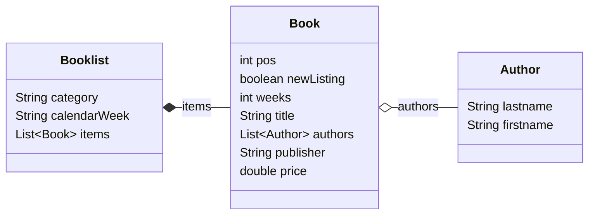

JSON Processing
===============
In diesem Modul werden die drei verbreiteten Java JSON Bibliotheken *GSON*, *Jackson*, *JsonP/JsonB* verwendet um ein einfaches Java Objekt einzulesen und auszugeben.

Datenmodel
-----
Als Datengrundlage für den Test dient die aktuelle Spiegel-Bestsellerliste "Sachbuch Paperback" ([Quelle](https://www.spiegel.de/kultur/literatur/bestseller-paperback-sachbuch-a-dd0efe3f-eaf1-47f7-b5a4-f5cdf0a6da3a?sara_ref=re-xx-cp-sh)).

Aus den Daten wurde folgendes Model abgeleitet:



Die Daten wurde ein eine JSON-Struktur überführt ([Datei](src/main/resources/spiegel_bestseller_paperback-sachbuch_2023-W33.json)).
Es folgt ein Auzug daraus mit einem Eintrag:

```json
{ "category": "Sachbuch / Paperback",
  "calendarWeek": "2023-W33",
  "items": [
    {"..."}, 
    { "pos": 12,
      "newListing": false,
      "weeks": 13,
      "title": "Zieht euch warm an, es wird noch heißer!",
      "authors": [
        { "lastname": "Plöger",
          "firstname": "Sven"
        } ],
      "publisher": "Westend",
      "price": 22.00 
    },
    {"..."}
  ] 
}
```
JSON-Verarbeitung
-----------------
Für jede JSON Bibliothek (GSON, Jackson, JsonP) wurden verschiedene Möglichkeiten der Verarbeitung ausprogrammiert:
- Die Klasse `*Builder` enthält Code, der automatisch per Mapping aus einem JSON-String das Java-Objekt erstellt.
- Die Klasse `*Generator*` liest mit einem Reader die LowLevel-Json-Klassen für Objekte, Arrays und Werte ein und erstellt daraus das Java-Objekt-Model. (Das entspricht in XML der Verarbeitung mit DOM)
- Die Klasse `*Serializer` nutzt eine Streaming-API. Diese erzeugt beim Einlesen des JSON-Strings Events, wenn Objekte, Arrays und Werte erkannt werden.
Entsprechend des erkannten Events werden dann die enstprechenden Strukturen im Java-Objekt-Modell angelegt. Beim Schreiben werden ausgehend vom Java-Objekt-Modell ebenfalls Events generiert und an einen Writer geschickt. (Das entspricht in XML der Verarbeitung mit SAX). Vorteil ist, dass bei größeren Strukturen, die JSON-Objekte nicht im Hauptspeicher vorgehalten werden, sondern sofort in eine Datei geschrieben werden können.


