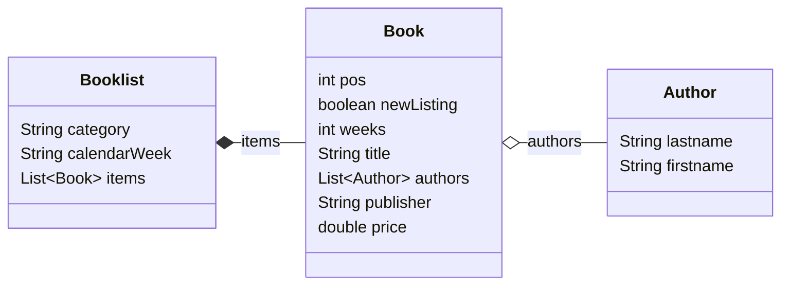

JSON Processing
===============
In diesem Modul werden die drei verbreiteten Java JSON Bibliotheken *GSON*, *Jackson*, *JsonP/JsonB* verwendet um ein einfaches Java Objekt einzulesen und auszugeben.

Datemodel
-----
Als Datengrundlage für den Test dient die aktuelle Spiegel-Bestsellerliste "Sachbuch Paperback" ([Quelle](https://www.spiegel.de/kultur/literatur/bestseller-paperback-sachbuch-a-dd0efe3f-eaf1-47f7-b5a4-f5cdf0a6da3a?sara_ref=re-xx-cp-sh)).

Aus den Daten wurde folgendes Model abgeleitet:



Die Daten wurde ein eine JSON-Struktur überführt ([Datei](src/main/resources/spiegel_bestseller_paperback-sachbuch_2023-W33.json)).
Es folgt ein Auzug daraus mit einem Eintrag:

```json
{ "category": "Sachbuch / Paperback",
  "calendarWeek": "2023-W33",
  "items": [
    ...
    { "pos": 12,
      "newListing": false,
      "weeks": 13,
      "title": "Zieht euch warm an, es wird noch heißer!",
      "authors": [
        { "lastname": "Plöger",
          "firstname": "Sven"
        } ],
      "publisher": "Westend",
	  "price": 22.00 	},
    ...
  ] 
}
```
