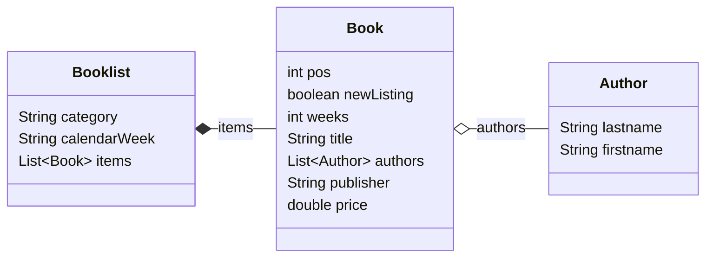

JSON Processing
===============
In diesem Modul werden die drei verbreiteten Java JSON Bibliotheken *GSON*, *Jackson*, *JsonP/JsonB* verwendet um ein einfaches Java Objekt einzulesen und auszugeben.

Datemodel
---------
Als Datengrundlage für den Test dient die aktuelle Spiegel-Bestsellerliste "Sachbuch Paperback" ([Quelle](https://www.spiegel.de/kultur/literatur/bestseller-paperback-sachbuch-a-dd0efe3f-eaf1-47f7-b5a4-f5cdf0a6da3a?sara_ref=re-xx-cp-sh)).

Aus den Daten wurde folgendes Model abgeleitet:



Die Daten wurde ein eine JSON-Struktur überführt ([Datei](src/main/resources/spiegel_bestseller_paperback-sachbuch_2023-W33.json)).
Es folgt ein Auzug daraus mit einem Eintrag:

```json
{ "category": "Sachbuch / Paperback",
  "calendarWeek": "2023-W33",
  "items": [
    {"..."}, 
    { "pos": 12,
      "newListing": false,
      "weeks": 13,
      "title": "Zieht euch warm an, es wird noch heißer!",
      "authors": [
        { "lastname": "Plöger",
          "firstname": "Sven"
        } ],
      "publisher": "Westend",
	  "price": 22.00 },
    {"..."},
  ] 
}
```

Java-Bibliotheken
------------------

### GSON
GSON ist eine ursprünglich von Google entwickelte Java-Bibliothek zur Konvertierung von Java-Objekten in ihre JSON-Representation.
Es kann außerdem verwendet werden, um aus einem JSON-String das entsprechende Java-Objekt zu erzeugen.

*Lt. Webseite befindet sich das Projekt derzeit im Maintainance-Mode*

- Projekt-Webseite: [Github](https://github.com/google/gson)
- Dokumentation: [User Guide](https://github.com/google/gson/blob/main/UserGuide.md)

### Jackson
> Jackson has been known as "the Java JSON library" or "the best JSON parser for Java". Or simply as "JSON for Java".
> More than that, Jackson is a suite of data-processing tools for Java (and the JVM platform), including the flagship streaming JSON parser / generator library, matching data-binding library (POJOs to and from JSON) and additional data format ...

- Projekt-Website: [Github](https://github.com/FasterXML/jackson)
- Dokumentation: [Jackson-Docs](https://github.com/FasterXML/jackson-docs)

### Jakarta EE Json-B/Json-P

- Projekt-Webseite: [Jakarta JSON Processing](https://jakarta.ee/specifications/jsonp/) [Jakarta JSON Binding](https://jakarta.ee/specifications/jsonb/)
- Source-Code: [Github: jsonp-api](https://github.com/jakartaee/jsonp-api), [Github: jsonb-api](https://github.com/jakartaee/jsonb-api)


Vearbeitungsmöglichkeien
------------------------
Folgende drei Möglichkeiten der JSON-Verarbeitung sollen für die drei Bibliotheken untersucht werden

### Java-Objekt-Binding
Hier wird automatisch aus einem Java-Objekt die JSON-Struktur abgeleitet.
Alle Bibliotheken erlauben durch Annotationen an den Java-POJOs den Serialisierungs/DeSerialisierungsprozess zu steuern.
Um die Beispiele möglichst einfach zu gestalten wurde hier darauf verzichtet.

In der Beispiel-Implementierung enden diese Klassen auf `*Builder`.

### JSON-Objekt-Modell
Alle APIs bilden die JSON-Struktur auf Java-Objekte ab. Dafür gibt es Klassen, wie `JsonObjekt`, `JsonArray`, `JsonValue`.
Die Java-Basistypen (String, Integer, Double, Boolean) können in der Regel einfach auf den entsprechenden Json-Typ abgebildet werden.

In der Beispiel-Implementierung enden diese Klassen auf `*Generator`.

### Streaming API
Um große JSON-Dokumente zu verarbeiten bieten alle Bibliotheken auch eine Streaming-API.
Das JSON-Dokument wird eingelesen und Ereignisse generiert (`START_OBJECT`, `END_OBJECT`, `START_ARRAY`, `END_ARAY`, `NAME_TOKEN`, `VALUE_TOKEN`, ...).
Auch beim Schreiben einer JSON-Struktur werden Events an den JSON-Prozessor gesendet.
Dadurch muss nicht die gesamte JSON-Struktur im Hauptspeicher vorgehalten werden. 

Der Ansatz entspricht der in der XML-Welt bekannten [SAX-API](https://de.wikipedia.org/wiki/Simple_API_for_XML)).

In der Beispiel-Implementierung enden diese Klassen auf `*Serializer`.


Evaluation
----------
### GSON
- "funktioniert einfach", allerdings "Maintenance-Mode"
- Default-Serialsierung von Datums-Objekten unbrauchbar

### Jackson
- aktuelles Jackson v2.15 basiert noch auf Java7 
  - -> Erweiterungsmodule für Java 8-Features (Optionals, DateTime-API, ...) notwendig
  - dadurch umständliche Konfiguration in Maven
- unübersichtliche API
  - Mix von Factory- und Konverter-Methoden in einer Klasse
  - ähnliche Methoden, z.,B. `textValue()`, `asText()`, `asText(defaultValue)`
- Modul für Json-P Implementierung vorhanden


### Jakarta EE Json-B/Json-P
- Trennung von API und Implementation
- in der "Umstellungsphase nach Jakarta war es schwer, die *richtigen* Pakete in Maven zu finden.
